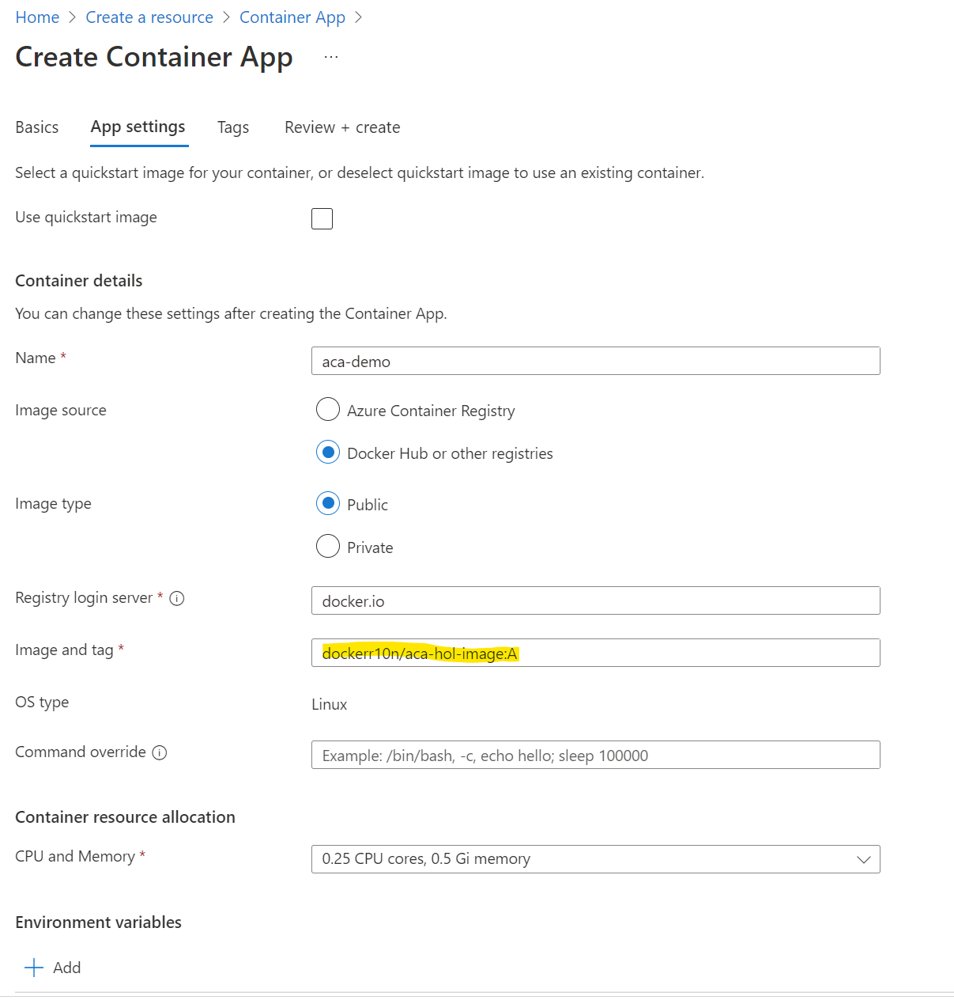

# Azure Container Apps Hands-on-Labs

## Overview 
Martha, the CTO of the boutique cloud-native technologies consulting firm - StartUps & More Inc. (SUM Inc.), requires  her consultants to be conversant with emergent technologies & methodologies at a consistent yet fast pace. One of the key decisions she makes with the  advent of every new technology is to determine - it's fit-to-purpose & efficacy - before having her consultants delve deeper themselves & consequently having them help their firm's clients.

Azure Container Apps (ACA) - the newest offering from Microsoft providing a serverless platform for running containerized microservices  - is on the top of Martha's emerging tech list for a few  important reasons that she has heard so far -
1. ACA can empower developers to build cloud-native solutions focusing on their apps rather than cloud infrastructure. 

   *Something that resonated even more - considering startup teams would rather focus on product differentiation, speedy go-to-market as compared to foundational infrastructure setup, security & Day-2 operations.*

2. ACA is built on the foundation of open-source  Cloud Native Computing Foundation (CNCF) projects like - Kubernetes Event Driven Autoscaling (KEDA) and Distributed Application Runime (Dapr) which are gaining adoption amongst cloud nativedevelopers  & ACA inherently utilizing the CNCF Graduated prooject - Envoy - for its service-proxy functionality.

   *Serverless PaaS powered by CNCF projects to enable developers - sounded like an attractive proposition*

BUT all of this was *still* a surmise ; Martha has looped in and tasked two of her top engineers Alice and Bob to conduct a timeboxed evaluation resulting in key findings based on hands-on evaluation. 
This time-boxed evaluation methodology has proven to be a strategic advantage to Martha's firm for many years.

Alice is a Kubernetes expert having worked with several of SUM Inc.'s clients on anything ranging from - large DIY Kubernetes clusters - to - vendor managed Kubernetes offerings including the Azure Kubernetes Service (AKS) from Microsoft. She has recently aced the Certified Kubernetes Administrator & Certified Kuberneted Application Developer - exams from the Linux Foundation.

Bob is a polyglot developer - addressing  the full-stack of cloud native application development. He is familiar with containerization & orchestration but would rather spend his time building high-performant microservices and applying the needed development rigor driven by well-adopted software development patterns.

Alice and Bob - proceed on the quest set forth by Martha.

## The First Take & next steps

*Alice and Bob - readup on some key documentation, announcements from the Microsoft Product Group and some reference material to utilize as part of the ongoing assessment.*


*To be done*

## Executive summary

*Crisp tabulation of Alice and Bob's findings reported back to Martha before getting the approval to proceed on the hands-on-evaluation and labs*

*To be done*

## The Labs


### Lab 1 – Create an Azure Container Apps service using the Azure Portal.

**Objectives:**

a. Create the environment & test a simple container app using the Azure Portal.   
b. Utiize multiple revisions and test Traffic Split functionality with 2 different versions of the same app.  
As part of the environment creation & deployment  get familiar with the UI and learn the Azure Container App specific terminologies & features.  
  ***
**1.a. Create a Container App environment & test a simple app**

In the Azure Portal, click on [+ Create a Resource] and type in "Container App"


 ***


[Create Container App - Basics] tab  


Project Details

Choose the [Subscription] you would like to use.
It is recommended that you create a new resource group so fill in a name & create a new resource group by clicking on the [Create New] hyperlink.
Provide a [Container app name] of your choice _e.g. aca-hol-demo_


Container Apps Environment

Choose the [Region] you want to deploy to from the drop-down of available regions.

**As it is the first time, click on the [Create new] hyperlink to create a new [Container Apps Environment]**


**Note:** _An environment in Azure Container Apps creates a secure boundary around a group of container apps. Container Apps deployed to the same environment are deployed in the same virtual network and write logs to the same Log Analytics workspace._

 ***
 

  
**[Create Container Apps Environment - Basics] tab**

Environment details

Provide an [Environment name] 

Zone Redundancy (ZR) - The decision to make this Container App Environment - zone redundant is to be made at deployment time. The Container App Environment cannot be made zone redundant If NOT deployed as zone redundant at the time of creation.
For Lab 1 - let us leave [Zone redundancy] as [Disabled]

 ***
[Create Container Apps Environment - Monitoring] tab

A [Log Analytics workspace] name is pre-populated for you. You can choose to [Create new] using the link.


 ***
 
**[Create Container Apps Environment - Networking] tab**

Virtual Network

For Lab 1 - we are not going to choose a own virtual network (VNet). So choose [No]

But for future reference, choose [Yes]  just to make a note of this part for when you create an container app environment beyond this lab - that you get to choose an existing VNet or [Create new].
  
And then observe the menu to provide the [Infrastructure subnet] range.

The choice to have the Virtual IP as [Internal] only with the endpoint being an internal load balancer [OR] to expose the apps on an internet accessible IP address is also made here.

Now, revert to choosing [No] and click [Create]


 ***
 
 
  **[Create Container Apps Environment - App Settings] tab**




Uncheck the [Use quickstart image] check-box as we want to deploy our own simple app; the container image of our app is in the public Docker Hub.

[Container details]
  
[Name] Provide a name for the container
[Image Source] Select [Docker Hub or other registries]
[Image type]   Select [Public]
  
 [Registry login server] can be retained as [docker.io]
 
 [Image and tag] Enter the value [ dockerr10n/aca-hol-image:A ] 
  
 [Container resource allocation] - FOr this lab retain the default first value but observe that there is a set of choices that can be made based on your container's  CPU and memory requirements.

Application ingress settings

[HTTP Ingress]    - Check/ enable the checkbox

[Ingress traffic] - Select the [Accepting traffic from anywhere] button.

[Target port]      - Enter 80
 ***
 
 

 **Click through [Next: Tags] and then go to [Next: Review + create >] & click on [Create]**


 ***
 
 
**In your resource group observe that the following resources are created** 


 ***
 
 
CLick on the [Container App] resource and observe the Application URI and click on it   


 ***
 


**After you click the Application URI - you should see the following displayed in your browser**  


 ***


### Lab 2 – Create an ACA service – scripted mode

```

## Deploy with CLI

# Login to the CLI
az login

# Install the ACA extension for the CLI
az extension add --name containerapp --upgrade

# Register the Microsoft.App namespace
az provider register --namespace Microsoft.App

# Register the Microsoft.OperationalInsights provider for the Azure Monitor Log Analytics workspace if you have not used it before.
az provider register --namespace Microsoft.OperationalInsights

# Set the following environment variables

RESOURCE_GROUP="your-container-app-name"
LOCATION="eastus"
CONTAINERAPPS_ENVIRONMENT="your-environment"

# Create a resource group to organize the services related to your new container app

az group create \
  --name $RESOURCE_GROUP \
  --location $LOCATION
  
# Create the ACA Environment

az containerapp env create \
  --name $CONTAINERAPPS_ENVIRONMENT \
  --resource-group $RESOURCE_GROUP \
  --location $LOCATION
  
 # Create the Container App
 
 az containerapp create \
  --image "docker.io/dockerr10n/aca-hol-image:A" \
  --name my-container-app \
  --resource-group $RESOURCE_GROUP \
  --environment $CONTAINERAPPS_ENVIRONMENT
  --target-port 80 \
  --ingress 'external' \
  --query configuration.ingress.fqdn

# Navigate to the FQDN returned

```
### Lab 3 – Deploy and test 2 Container Apps with one calling the other ... 

We use the same ACA Environment and environment variables created earlier in [Lab 2] to deploy 2 additonal Container Apps.  

One  is a DotNet app. &  the other is a NodeJS app - with the NodeJS app being exposed for public access. The Dotnet app has internal ingress only.
The FQDN of the DotNet app is set as an Environment Variable - which is subsequently passed to and utilized by the NodeJS app.


```
# Deploy the container-2-dotnet dotnet-app
az containerapp create \
  --name dotnet-app \
  --resource-group $RESOURCE_GROUP \
  --environment $CONTAINERAPPS_ENVIRONMENT \
  --image 'ghcr.io/azure-samples/container-apps-connect-multiple-apps/dotnet:main' \
  --target-port 80 \
  --ingress 'internal'

DOTNET_FQDN=$(az containerapp show \
  --resource-group $RESOURCE_GROUP \
  --name dotnet-app \
  --query configuration.ingress.fqdn -o tsv)

# Deploy the container-1-node node-app
az containerapp create \
  --name node-app \
  --resource-group $RESOURCE_GROUP \
  --environment $CONTAINERAPPS_ENVIRONMENT \
  --image 'ghcr.io/azure-samples/container-apps-connect-multiple-apps/node:main' \
  --target-port 3000 \
  --ingress 'external' \
  --environment-variables DOTNET_FQDN=$DOTNET_FQDN \
  --query configuration.ingress.fqdn
```


### Lab 4 – KEDA in action with Scale to Zero

*Introduce KEDA, hands-on sample with AKS (if needed) , then contrast with ACA ease of use and incorporate HTTP handler based scaling down to zero.*
*To be done*

### Lab 5 – Monitoring an ACA app

*Monitoring fundamentals driven by the Log Analytics workspace. Visualize the monitoring with an Azure native option*

*To be done*


### Lab 6 – ACA versioning using [Revisions]

*Exercise introducing multiple iterative changes including app scope changes and enabling audience to learn how Revisions in ACA help with versioning.*

*To be done*


 
